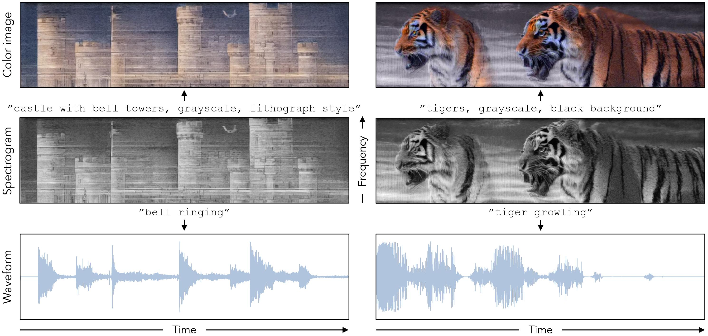

# Images that Sound

[Ziyang Chen](https://ificl.github.io/), [Daniel Geng](https://dangeng.github.io/),  [Andrew Owens](https://andrewowens.com/)

University of Michigan, Ann Arbor

arXiv 2024

[[Paper](https://arxiv.org/abs/2405.12221)] [[Project Page](https://ificl.github.io/images-that-sound/)]
<hr>

This repository contains the code to generate *images that sound*, a special spectrogram that can be seen as images and played as sound.
<div align="center">
  
</div>


## Environment
To setup the environment, please simply run:
```bash
conda env create -f environment.yml
conda activate soundify
```
***Pro tip***: *we highly recommend using [mamba](https://github.com/conda-forge/miniforge) instead of conda for much faster environment solving and installation.*

**DeepFlyod**: our repo also uses [DeepFloyd IF](https://huggingface.co/docs/diffusers/api/pipelines/deepfloyd_if). To use DeepFloyd IF, you must accept its usage conditions. To do so:

1. Sign up or log in to [Hugging Face account](https://huggingface.co/join).
2. Accept the license on the model card of [DeepFloyd/IF-I-XL-v1.0](https://huggingface.co/DeepFloyd/IF-I-XL-v1.0).
3. Log in locally by running `python huggingface_login.py` and entering your [Hugging Face Hub access token](https://huggingface.co/docs/hub/security-tokens#what-are-user-access-tokens) when prompted. It does not matter how you answer the `Add token as git credential? (Y/n)` question.


## Usage

We use pretrained image latent diffusion [Stable Diffusion v1.5](https://huggingface.co/runwayml/stable-diffusion-v1-5) and pretrained audio latent diffusion [Auffusion](https://huggingface.co/auffusion/auffusion-full-no-adapter), which finetuned from Stable Diffusion. We provide the codes (including visualization) and instructions for our approach (multimodal denoising) and two proposed baselines: Imprint and SDS. We note that our code is based on the [hydra](https://github.com/facebookresearch/hydra), you can overwrite the parameters based on hydra.

### Multimodal denoising
To create *images that sound* using our multimodal denoising method, run the code with config files under `configs/main_denoise/experiment`:
```bash
python src/main_denoise.py experiment=examples/bell
``` 
**Note:** our method does not have a high success rate since it's zero-shot and it highly depends on initial random noises. We recommend generating more samples such as N=100 to selectively hand-pick high-quality results. 


### Imprint baseline
To create *images that sound* using our proposed imprint baseline method, run the code with config files under `configs/main_imprint/experiment`:
```bash
python src/main_imprint.py experiment=examples/bell
``` 

### SDS baseline
To create *images that sound* using our proposed multimodal SDS baseline method, run the code with config file under `configs/main_sds/experiment`:
```bash
python src/main_sds.py experiment=examples/bell
``` 
**Note:** we find that Audio SDS doesn't work for a lot of audio prompts. We hypothesize the reason is that latent diffusions don't work quite well as pixel-based diffusion for SDS. 

### Colorization
We also provide the colorization code under `src/colorization` which is adopted from [Factorized Diffusion](https://github.com/dangeng/visual_anagrams). To directly generate colorized videos with audio, run the code:
```bash
python src/colorization/create_color_video.py \
  --sample_dir /path/to/generated/sample/dir \
  --prompt "a colorful photo of [object]" \
  --num_samples 16 --guidance_scale 10 \
  --num_inference_steps 30 --start_diffusion_step 7
```
**Note:** since our generated images fall outside the distribution, we recommend running more trials (num_samples=16) to select best colorized results. 


## Acknowledgement
Our code is based on [Lightning-Hydra-Template](https://github.com/ashleve/lightning-hydra-template), [diffusers](https://github.com/huggingface/diffusers), [stable-dreamfusion](https://github.com/ashawkey/stable-dreamfusion), [Diffusion-Illusions](https://github.com/RyannDaGreat/Diffusion-Illusions), [Auffusion](https://github.com/happylittlecat2333/Auffusion), and [visual-anagrams](https://github.com/dangeng/visual_anagrams). We appreciate their open-source codes.